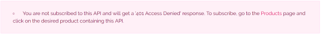
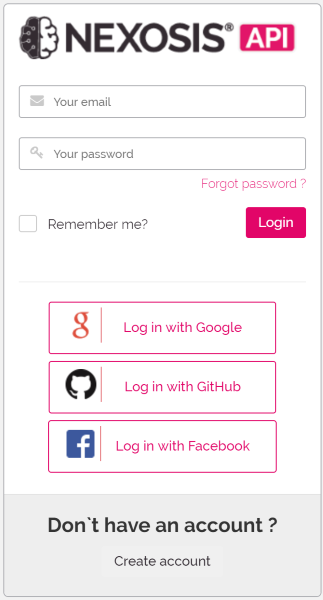
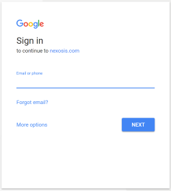
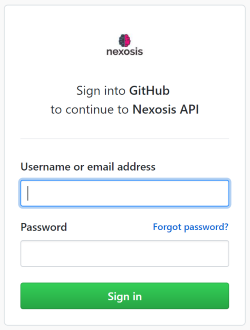
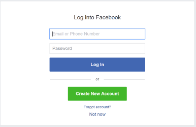
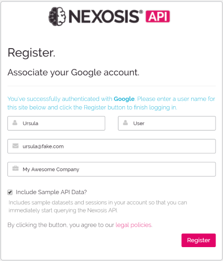
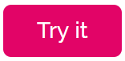
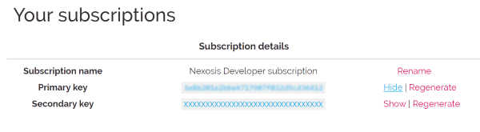

When you first visit [the Nexosis API website](https://developers.nexosis.com) you will be browsing as a guest. Guests are welcome to review all of the interactive API documentation, but in order to really get to work you're going to want to create an account and get your API keys. In fact, the "Try It" links in the interactive documentation won't work for you until you do and you'll see this warning:

To remedy this situation you can get started by clicking the *Sign In* link in the upper right corner of the page. This will take you to the [login page](https://account.nexosis.com/account/login) where you will see the following panel.

Since you don't have an account, you can either choose to login with one of the services displayed, or click the "Create account" link in the gray box at the bottom to create an account directly with Nexosis.

### 3rd Party Login

To create your account by associating it with one of the 3rd party providers click on the box with the icon of the service you want to use. You will be directed to the OAuth page for that particular provider.

When you are done signing in with your provider you will be directed back to Nexosis in order to finish adding your account details. A few details are filled in for you based on your provider's supplied account information. You can modify these.
>Notice the checkbox at the bottom which allows you to add sample data to your account. Select this option if you plan to follow along with some of our tutorials, or if you want to play with the API but don't have your own data yet.

At this point you're almost done. We just have a few questions for you and you're on your way back to the interactive documentation landing page. Now you can click through to the  page and start using the API immediately.

### Create a Nexosis Account

If you don't have an account with one of our integrated providers, or simply don't want to use one, then click on the *Create account* link instead and you'll immediately be on the registration panel as above. The only difference here is that you'll need to provide all the details - including a password.
> Passwords must be at least 6 characters, contain at least one non-alpha-numeric character, at least one numeric, and an uppercase and lowercase alpha.

### Obtaining Your API Keys

Now that you're a registered user you can start using the API with your own code. In order to call the API you must send your API key in the header of all your requests. You can find this key under [your profile page](https://developers.nexosis.com/developer). To get to your profile either navigate to [https://developers.nexosis.com/developer](https://developers.nexosis.com/developer) directly or choose profile from the upper right navigation when you are logged into the site.

You have two API keys - a primary and secondary - which are masked. To show your key and copy it, just click *Show* to the right of it.

You'll notice that this is also where you can manage your keys by regenerating as well for those times when you accidentally commit them to your git repo.

------

That's it - you're all set to go and make something smart!
