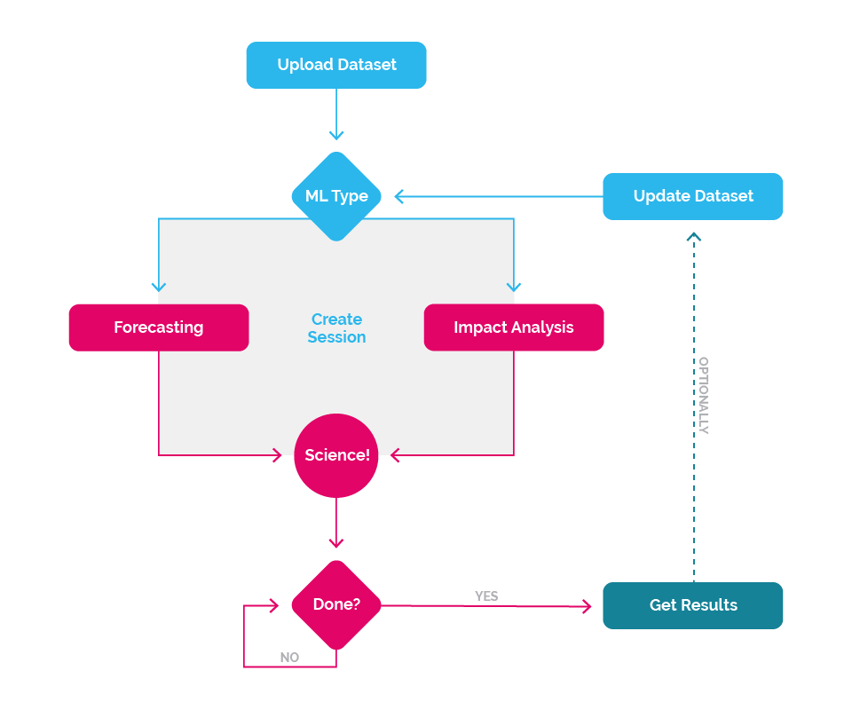

## The Process

Before coding up your first application, take a moment to familiarize yourself with the process and concepts of generating predictions and measuring impact.

We've worked hard to keep the high-level process simple. Here's the basic process:

1. [Submit a _DataSet_](#dataset)
2. [Initiate a _Forecast Session_ or an _Impact Analysis Session_](#session)
3. [Retrieve the Results](#results)

Then optionally:

1. Update _DataSet_ with additional new data
2. Start a new session. Repeat.

### <a name="dataset" class="jumptarget">Submit A _DataSet_</a>

All Machine Learning processes must start with data and a question you are trying to gain insight into. This question could range from "How many robots will I sell next month?" to "What was the impact of our new marketing strategy on our Facebook likes?" 

To use the Nexosis API, you must provide us with a _DataSet_. This DataSet is simply a series of values with corresponding timestamps for when these events were measured. For example, it could be number of robot units sold each day for the last three years or the hourly number of website visitors for the last few months. Along with this historical data, you can add additional data points. This is where business intuition and understanding, creativity come into play. These additional data points could be a series of calendar events such as Black Friday, a promotion running at that store that week, a major sporting event on TV that afternoon, or heavy snow over the lunch hour.

The data submitted is very important as it is used to discover predictive relationships within the data using a host of algorithms. This discovery process happens during  what we call a _Session_.

Read [Sending Data](ImportingData) for the technical details.

### <a name="session" class="jumptarget">Initiate a _Session_</a>

A _Session_ is simply the a discovery process using the supplied DataSet.

There are two types of Sessions today:

* [Forecasting](Forecast)
* [Impact Analysis](ImpactAnalysis)

This is where the data science happens at scale. Behind the scenes a host of algorithms will work to discover what makes your DataSet tick, attempting to find what factors are influential to others, where the correlations are and ultimately provide predictions or impact.

Read [Sessions](session) for the technical details.

### <a name="results" class="jumptarget">Retrieve the Results</a>

Once the Session has Complete successfully, the results can be retrieved. Depending on the type of Session, the results will contain prediction or impact analysis results.

Read [Retrieving a Session](session#retrievingSession) for more technical details.
