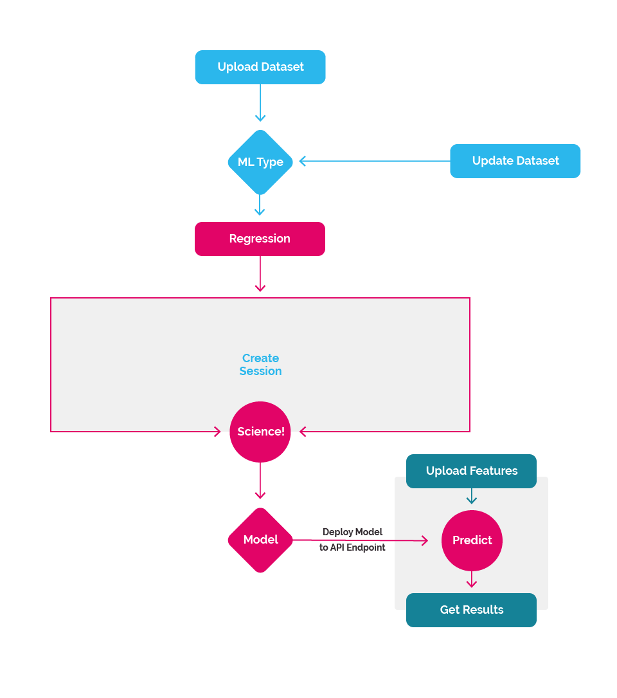

## The Process

Regression allows you to estimate the relationships between variables. The Nexosis API allows you to upload a dataset and it will model these relationships. Once the relationship is understood, this model is persisted and used to further predict values, given new inputs. Before using Regression, take a moment to familiarize yourself with the high-level process.

We've worked hard to keep the high-level process simple. Here's the basic process:

1. [Submit a _Dataset_](#dataset)
2. [Initiate a _Session_](#session)
3. [Get Results](#results)

Then optionally:

1. [Use Model API Endpoint](#predict) to make predictions, if you liked the Results of the model.
2. Update _Dataset_ with additional new data and rebuild, or train new model.
3. Start a new Session. Repeat.

|

### <a name="dataset" class="jumptarget">Submit a _Dataset_</a>

Regression is a process by which the Nexosis API, through the analysis of a particular dataset, will attempt to understand the relationship a series of variables have with one specific target value given many different sets of observed data. This relationship can then be used to predict a new target value given any combination of known new variables.

For example, if you wanted to be able to predict an approximate sale price of a house, you'd need a dataset containing real attributes of many different kinds of houses and their real historical sale price.  Each row describes a distinct house - its columns represent specific attributes (independent variables) that likely influence the sale price (dependent variable). These independent variables are called _features_ and the dependent variable is called the _target_. Some examples of attributes that might correspond to the sale price could be the year a house was built, the number of rooms, the number of bathrooms, livable square footage, zip code, and so on.

Once the _dataset_ has been submitted, a _regression_ session can be created to build a model.

Read [Sending Data](sendingdata) for the technical details.

### <a name="session" class="jumptarget">Initiate A _Session_</a>

A _Session_ is simply the a discovery process using the supplied Dataset. This exploration of the data is computationally expensive and can be time consuming, depending on the amount of data in the _dataset_.

This is where the data science happens at scale. Behind the scenes a host of algorithms will work to discover what makes your Dataset tick, attempting to find what factors are influential to others, where the correlations are and ultimately provide predictions given new data inputs.

Read [Sessions](session) for the technical details.

### <a name="results" class="jumptarget">Retrieve the Results</a>

Once the all the results are analyzed and the relationships present are discovered, a model is built and deployed. The _SessionResult_ will contain a the _modelId_ used to identify production model endpoint where predictions get made. Additionally, the session result will also returns metrics to illuminate the strength of the relationships that were found between the features and the target value in the form of an accuracy metric in the dataset.

Read [Retrieving a Session](session#retrievingSession) for more technical details.

### <a name="predict" class="jumptarget">Use Model API Endpoint</a>

Once the model is deployed and you like there results, it becomes your prediction endpoint. By simply sending in new variables, or series of variables a set of predictions can be made.

Over time you may collect more data that can help improve the model, or you could add additional variables to the _dataset_ allowing even better predictions in the future. Simplely upload more data and create a new session and get new results! Each new session will create a new model with a new _modelId_, so you don't have to worry about your current model getting clobbered.

Read [Prediction Quick Start](quickstartguidepredict) for an end-to-end example where you can see how the whole process works.