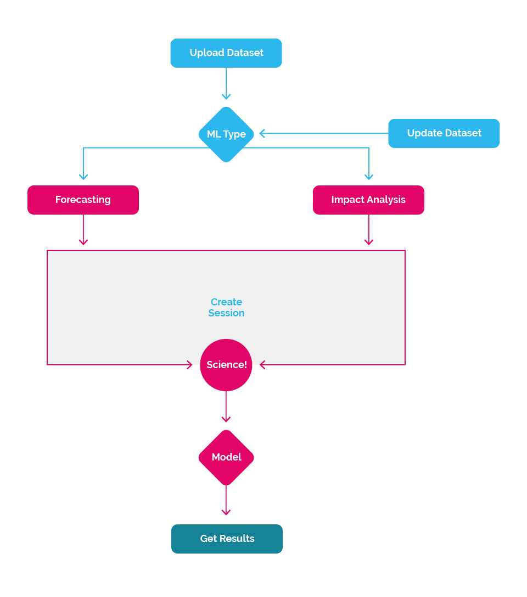

## The Process

#### Before making Time-Series forecasts or finding impacts, take a moment to familiarize yourself with the high-level process.

We've worked hard to keep the high-level process simple. Here's the basic process:

1. [Submit a _Dataset_](#dataset)
2. [Initiate a _Forecast Session_ or an _Impact Analysis Session_](#session)
3. [Retrieve the Results](#results)

Then optionally:

1. Update _Dataset_ with additional new data
2. Start a new Session. Repeat.

<h3 id="dataset" class="jumptarget">Submit a Dataset</h3>

#### To generate time-series based forecasts from a dataset, the dataset must have a date column. The date column can be assigned the role `timestamp` when submitting the dataset, but that's not required until initiating a session.

For example, you may have a dataset of house prices with features describing the houses including the year that house was built. Even though you have a date as a feature, this is not a time series problem and you would want to choose to use [regression](regression). In time series forecasting, we are generally interested in predicting something that is changing over time, but in this dataset, we have several different houses with one date and will be predicting prices of other houses. So, this is a  [regression](regression) problem.

In a time series problem, we expect observations close to each other in time to be more similar than observations far away, after accounting for seasonality. For example, the weather today is usually more similar to the weather tomorrow than the weather a month from now. So, predicting the weather based on past weather observations is a time series problem.

If you’re still not sure which to use, and you have a date/timestamp with target values over time, you can always use our API to try both and compare the results.

_Read [Sending Data](sendingdata) for the technical details._

<h3 id="session" class="jumptarget">Initiate a Session</h3>

#### A _Session_ is simply the a discovery process using the supplied dataset.

There are two types of time-series based sessions today:

* [Forecasting](forecast)
* [Impact Analysis](impactanalysis)

This is where the data science happens at scale. Behind the scenes a host of algorithms will work to discover what makes your dataset tick, attempting to find what factors are influential to others, where the correlations are and ultimately provide predictions or impact.

_Read [Sessions](session) for the technical details._

<h3 id="results" class="jumptarget">Retrieve the Results</h3>

#### Once the session has completed successfully, the results can be retrieved. Depending on the type of session, the results will contain prediction or impact analysis results.

_Read [Retrieving a Session](session#retrievingSession) for more technical details._
