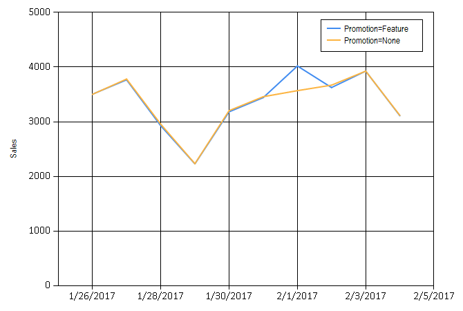

While the Nexosis API is able to forecast and analyze event impact on datasets with little additional guidance, it may be helpful to provide some metadata about your dataset to improve the quality of results.  In this tutorial, we will look at how to specify this metadata and use the Nexosis API to generate even better forecast and impact results.

----

## Uploading a dataset with metadata

Generally, [specifying column metadata](columnmetadata) on a dataset is optional.  The Nexosis API infers what kind of data is contained in a dataset column, and is able to use this information when a session is started.  But, these values can be overridden when a dataset is uploaded.  It is also possible to change the metadata of a dataset after it has been uploaded.  This is the data we will be working with:

``` csv
timeStamp,sales,promotion
12/31/2012 0:00,2919.51,
1/1/2013 0:00,0,TRUE
1/2/2013 0:00,0,TRUE
1/3/2013 0:00,0,TRUE
1/4/2013 0:00,0,TRUE
1/5/2013 0:00,0,TRUE
1/6/2013 0:00,0,TRUE
1/7/2013 0:00,0,TRUE
1/8/2013 0:00,2833.66,
1/9/2013 0:00,2978.66,
1/10/2013 0:00,3127.26,
1/11/2013 0:00,3638.69,
1/12/2013 0:00,2277.96,
```

This is sales data for a store over a four year time period.  The full dataset can be found [on our sample data repository](https://raw.githubusercontent.com/Nexosis/sampledata/master/LocationD-promotions.csv).

- `timestamp` - day of the observation
- `sales` - sales amount for that date
- `promotion` - a promotion occurred on dates marked `TRUE`

Days with a special promotion have a value of `TRUE`.  Dates with no value will be inferred as `FALSE`.  Other days do not contain a value in this column.  After uploading, we can see how the content of the columns are inferred in the response.  The datatypes of the columns are correctly identified, and the `sales` and `timestamp` columns has a role set.

``` json
{
    "dataSetName": "storePromotion",
    "columns": {
        "sales": {
            "dataType": "numeric",
            "role": "target"
        },
        "promotion": {
            "dataType": "logical",
            "role": null
        },
        "timeStamp": {
            "dataType": "date",
            "role": "timestamp"
        }
    }
}
```

----

## Forecasting

Now, let's say that we want to plan a new promotion in the future.  We can add to our dataset, uploading records for the dates that we plan to have a promotion, along with the flag in the `promotion` column.  We can also upload a `columns` object, and specify that the `promotion` column should be a `feature`.

``` http
PUT /v1/data/storePromotion HTTP/1.1
Host: https://ml.nexosis.com
Content-Type: application/json

{
    "columns": {
        "sales": {
            "dataType": "numeric",
            "role": "target"
        },
        "timeStamp": {
            "dataType": "date",
            "role": "timestamp"
        },
        "promotion": {
            "dataType": "logical",
            "role": "feature"
        }
    },
    "data": [
        {
            "timestamp": "02/01/2017 0:00",
            "promotion": "TRUE"
        }
    ]
}
```

If we run a prediction over this date range, we can see that the Nexosis API is able to use this flag in the forecast, and has taken into account that the future promotion will have a positive impact on sales.  This technique is useful for running "What if" scenarios, such as, trying the promotion on different future dates, to see which would generate highest increase in sales.

``` http
POST /v1/sessions/forecast?dataSetName=storePromotion&startDate=01/26/2017&endDate=02/05/2017 HTTP/1.1
Host: https://ml.nexosis.com
Content-Type: application/json
```



----

## Impact

Another useful scenario is determining the impact of a promotion in the past.  For this dataset, it will show the amount in sales gained by running the promotion.  When starting a session to test for this impact, we want to override the column metadata that we had set before.  We will be setting the `promotion` column to `none`, which means it is not used in the algorithms.  This is important to do for impact sessions, since we are trying to determine what would have occurred during a normal business day without a promotion.

``` http
POST /v1/sessions/impact?dataSetName=storePromotion&startDate=10/08/2016 00:00:00&endDate=10/08/2016 23:59:59 HTTP/1.1
Host: https://ml.nexosis.com
Content-Type: application/json

{
    "columns": {
        "sales": {
            "dataType": "numeric",
            "role": "target"
        },
        "timeStamp": {
            "dataType": "date",
            "role": "timestamp"
        },
        "promotion": {
            "dataType": "logical",
            "role": "none"
        }
    }
}
```

The results of this session show that having the promotion on this date resulted in an increase in sales of $225.69.

``` json
{
    "metrics": {
        "pValue": 0.2364,
        "absoluteEffect": 225.6874,
        "relativeEffect": 0.0704
    },
}
```

This is a simple example with only one feature column, but, these techniques can be used on datasets with more feature columns. Providing more data and context for the machine learning algorithms will often increase the increase the accuracy of your results.
