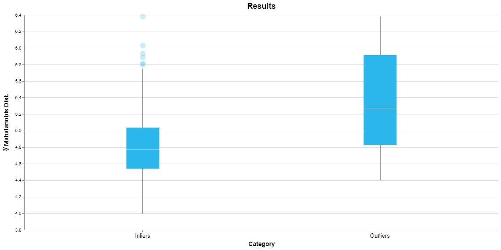
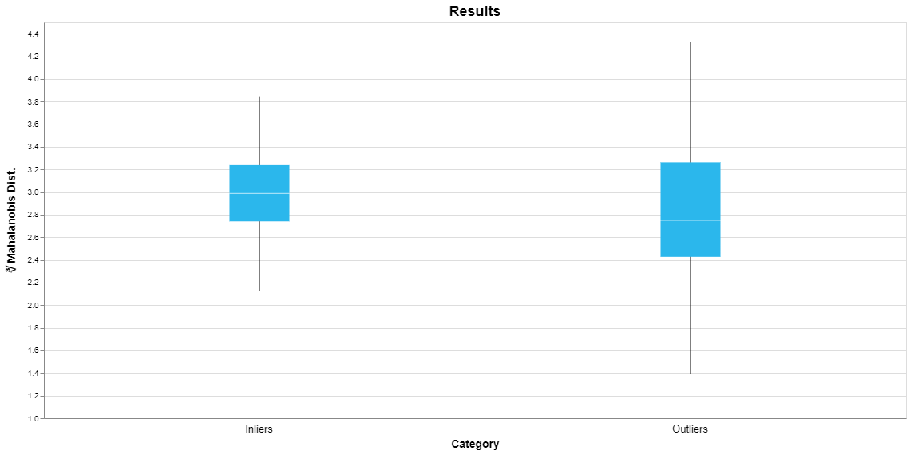

## Analyzing Anomaly Results

To present a visual summary of the results of an anomaly detection session we plot a quantity called the Mahalanobis distance for the normal and anomalous data points identified in the training dataset. (Strictly speaking we plot the cube root of the Mahalanobis distance.) The Mahalanobis distance is a measure of how far a sample is from a “typical” sample in the dataset. As you might guess, anomalous data points are farther from typical and hence their Mahalanobis distance will tend to be larger. Note that Mahalanobis distance is not used when building the model, so this plot is an independent check that an anomaly detection model is working as expected.

{:height="350px"}

Shown above is the result of an anomaly detection session for the wine dataset. Since we are looking at a distribution of values we use a Tukey box-and-whisker plot. The box represents the range of the middle 50% of the values from the 25th to the 75th percentile, the so-called interquartile range (IQR). The median is marked by the horizontal line within the box. The whiskers extend from the minimum to the maximum of all the values that lie within 1.5*IQR of the ends of the box. Any extreme values outside of the whiskers are plotted as individual points. This yields a quick visual summary of the range of Mahalanobis distances for all of the inliers and outliers identified in the training dataset. 

This plot shows that the outliers do tend to have a greater Mahalanobis distance than the inliers, as expected. This is reflected in the fact that the median for the outliers is a higher value and there is little overlap between the vertical range of the boxes.

The larger box for the outliers indicates that they tend to be spread over a broader range of values. The individual points for the inliers are samples that happen to have relatively large values for the Mahalanobis distance. But remember, the main point of this plot is to show that there is a difference between the typical behavior of the inliers versus outliers, taken as a group.

Now let’s consider an anomaly detection model for the iris dataset, shown here.

{:height="350px"}

This plot indicates that this model is probably not identifying truly anomalous samples. While this dataset includes three different classes of iris which are easily identified by a classification model, they do not separate into normal and anomalous samples. The plot shows that the median outlier actually has a smaller Mahalanobis distance than the median inlier and the minimum outlier has a smaller value than the minimum inlier.

What should you do if your anomaly detection model isn’t working correctly? Consider whether you can provide labels for your dataset and use classification instead. As a supervised machine learning approach, classification is likely to perform better than anomaly detection. Perhaps adding features to your dataset would improve performance. It is also possible that the dataset does not contain anomalies. In this case you should rebuild the anomaly detection model with that choice selected.
