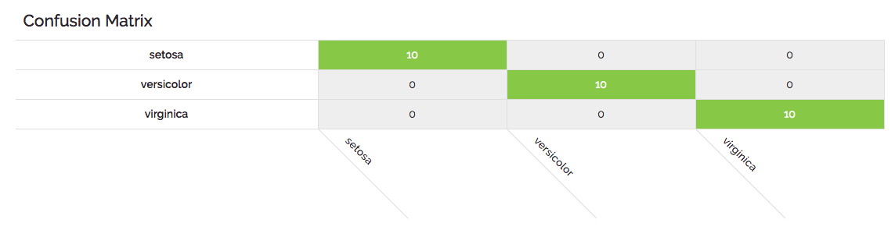
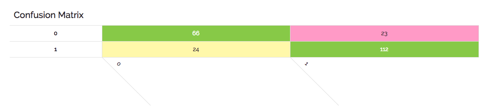
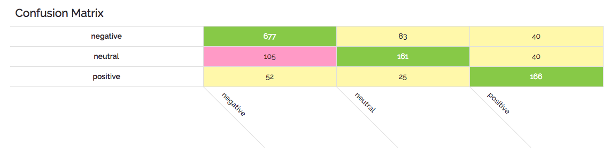

## Analyzing Classification Results

A confusion matrix is a very common way to analyze the results of a classification model. While you can read in-depth about them on [Wikipedia](https://en.wikipedia.org/wiki/Confusion_matrix), let's look at a few examples of how different results could be interpreted.

The intent of the matrix is to map class predictions from a model against the known correct class of the training data from a hold-out set used to test model results. 

We map each expected (actual) class along the vertical axis and every predicted value along the horizontal axis. This allows us to make a row-wise comparison of each class asking ourselves "when the actual (vertical) was classA, how many times did we predict (horizontal) classX". The sum of each row represents how many actual values were in the test set. The sum of each column represents the total predictions for that class during the test run. An example will make it clear.

In the canonical Iris example below we can see a model which gets everything right. 

{:width="800px"}

When most (or in this case all) of the values are represented in the diagonal from left to right, then our model has done well.  Here is another example based on our CS-GO datasets where the classes are simply "1" or "0" and the model was not perfect as above.

{:width="800px"}

In this case you can see that as we read a horizontal row for the actual value of "0" that 66 were correctly predicted to be "0", but that 23 predictions incorrectly classified a result of "1". So that's a total of 89 possible zeroes where the model missed around 26% of the time. 

One more example to help solidfy what you're seeing here. In the following example a number of tweets have been classified as either having "negative", "neutral", or "positive" sentiment. Here the model is decent, but again far from perfect.

{:width="800px"}

In this example you can again read across the rows and identify that the model had a hard time with "neutral" being falsely classified as "negative"; getting it wrong 105 times, or 34%. One of the other thing we can see in this matrix is that test values were overwhelmingly negative and that the model does pretty well with that dominant class; getting it right around 85% of the time.