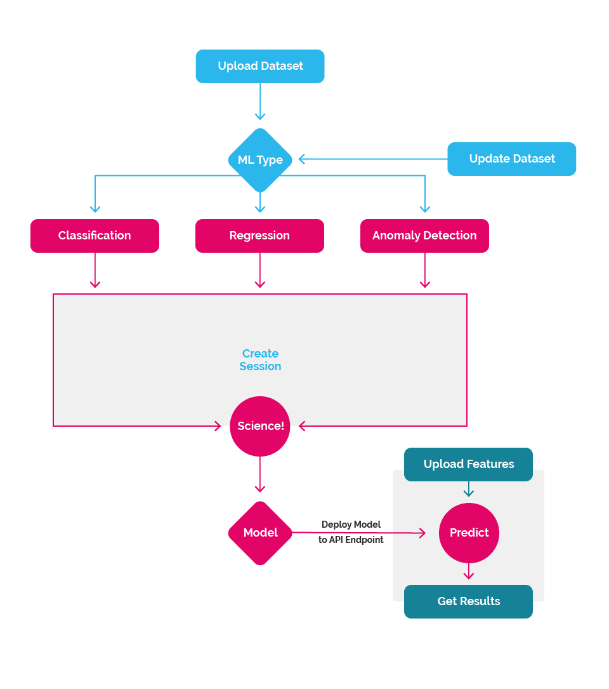

## The Process

#### Regression allows you to estimate the relationships between variables. Classification allows you to organize information into categories. Anomaly Detection helps you find outliers in your data. 

The Nexosis API allows you to upload a dataset and it will model these relationships. Once the relationship is understood this model is persisted and used to further predict values or classify your data, given new inputs. Take a moment to familiarize yourself with the high-level process before using Regression and Classification.

We've worked hard to keep the high-level process simple. Here's the basic process:

1. [Submit a _Dataset_](#dataset)
2. [Initiate a _Session_](#session)
3. [Get Results](#results)

Then optionally:

1. [Use the Model API endpoint](#predict) to make predictions if you liked the results of the model.
2. Update _Dataset_ with additional new data and rebuild, or train new model.
3. Start a new Session. Repeat.

|

<h3 id="dataset" class="jumptarget">Submit a Dataset</h3>

<h5>Anomaly Detection</h5>
Anomaly Detection is a process by which the Nexosis API, through the analysis of a particular dataset, will attempt to find observations in your dataset that fall outside of what's normal inside your dataset. It can then predict if other observations are anomalous, or outliers, using the generated model.

For example, if you had a variety of heart measurements from an EKG (encephalograph) you could determine if some of the signals were outside of the normal range.

<h5>The DataSet</h5>
Once the _dataset_ has been submitted, a _regression_ or _classification_ session can be created to build a model.

Read [Sending Data](sending-data) for the technical details.

<h3 id="session" class="jumptarget">Initiate A Session</h3>

A _Session_ is simply the process of building the model using the supplied Dataset. This exploration of the data is computationally expensive and can be time consuming depending on the amount of data in the _dataset_.

This is where the data science happens at scale. Behind the scenes a host of algorithms will work to discover what makes your dataset tick, attempting to find what factors are influential to others, where the correlations are and ultimately provide predictions given new data inputs.

_Read [Sessions](sessions) for the technical details._

<h3 id="results" class="jumptarget">Retrieve the Results</h3>

Once the all the results are analyzed and the relationships present are discovered, a model is built and deployed. The _SessionResult_ will contain a _modelId_ used to identify the production model endpoint where predictions get made. Additionally, the session result will also returns metrics to illuminate the strength of the relationships that were found between the features and the target value in the form of an accuracy metric in the dataset.

_Read [Retrieving a Session](session#retrievingSession) for more technical details._

<h3 id="predict" class="jumptarget">Use Model API Endpoint</h3>

Once the model is deployed and you like there results, it becomes your prediction endpoint. By simply sending in new variables - or series of variables - a set of predictions can be made.

Over time you may collect more data that can help improve the model, or you could add additional variables to the _dataset_ allowing even better predictions in the future. Simply upload more data and create a new session and get new results! Each new session will create a new model with a new _modelId_, so you don't have to worry about your current model getting clobbered.

## Further reading

Read [Prediction Quick Start](quick-start-guide-regression) for an end-to-end example where you can see how the whole process works with Regression.

Read [Classification Quick Start](quick-start-guide-classification) for an end-to-end example to see how the Classification process works.

Read [Anomaly Detection Quick Start](quick-start-guide-anomaly-detection) for an end-to-end example to see how the Anomaly Detection process works.