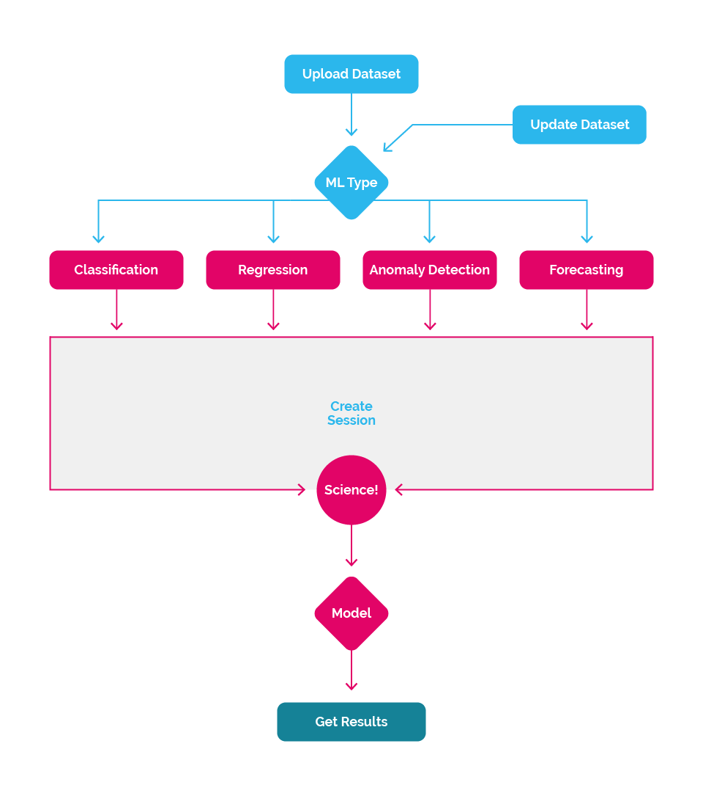

## The Process

#### Before coding up your first application, take a moment to familiarize yourself with the process of using the Nexosis API to make forecasts, predictions or measure impact.

We've worked hard to keep the high-level process simple. Here's the basic process:

1. [Submit a _dataset_](#dataset)
2. [Start a _model building session_](#session)
3. [Retrieve results](#results)

Then optionally:

1. Update your _Dataset_ with additional data
2. Start a new Session. Repeat.

<h3 id="dataset" class="jumptarget">Submit a dataset</h3>

All Machine Learning processes must start with data and a question you are trying to gain insight into. This question could range from "How many robots will I sell next Tuesday?" to "What was the impact of our new marketing strategy on our Facebook likes for the month following our new marketing campaign?"

To use the Nexosis API, you must provide us with a _Dataset_. This Dataset is simply a series of related values. For example, it could be number of robot units sold each day for the last three years or the hourly number of website visitors for the last few months. It could contain attributes of many different houses - the number of rooms, square footage, zip code, year built. Along with this historical data, you can add additional data points. This is where business intuition, understanding, and creativity come into play. These additional data points could be a series of calendar events such as Black Friday, a promotion running at that store that week, a major sporting event on TV that afternoon, or heavy snow over the lunch hour. 

The data submitted is very important, as it is used to discover relationships within the data using a host of algorithms. This discovery process happens during what we call a _Session_

_Read [Sending Data](sending-data) for more of the technical details on submitting data._

<h3 id="session" class="jumptarget">Start a model building session</h3>

A _Session_ is simply the discovery process using the supplied Dataset.

There are several types of sessions you can initiate and each type of Session can help answer different types of questions, but all act on the datasets you provide.

* [Classification](quick-start-guide-classification) - when you want to predict what category something is in.
* [Regression](regression-walkthrough) - when you want to make a prediction on data based on the discovered relationships in the data.
* [Forecasting](forecasting-walkthrough) - when you want to forecast how something might change over time.
* [Impact Analysis](impact-analysis) - running a forecast over time a historical time to see the impact of a change.
* [Anomaly Detection](quick-start-guide-anomaly-detection) - when you want to predict what category something is in.

This is where the data science happens at scale. Behind the scenes a host of algorithms will work to discover what makes your Dataset tick, attempting to find what factors are influential to others, where the correlations are and ultimately provide what's called a mathematical _Model_. This _Model_ is then used, and in many cases, stored permanently for you to reuse.

_Read about [Sessions](sessions) for more technical details on building sessions._

<h3 id="results" class="jumptarget">Evaluate the results and make predictions</h3>

Once the session has completed successfully, the Nexosis API builds a custom mathematical _Model_, based the data that was used to build, or _train_ that model.  You can think of a _model_ as a custom algorithm built based on the relationships found between the different data contained in the _dataset_. Depending on the type of session, the results will vary somewhat but generally will solve for a variable you want to predict, also called the _target_. Once the model is built, it can be evaluated and then used for predictions, forecasts, and to evaluate impact.

_Read [Retrieving a Session](session#retrievingSession) for more technical details._

> Not sure what do do next? [Next Steps](next-steps) is a good place to start.
