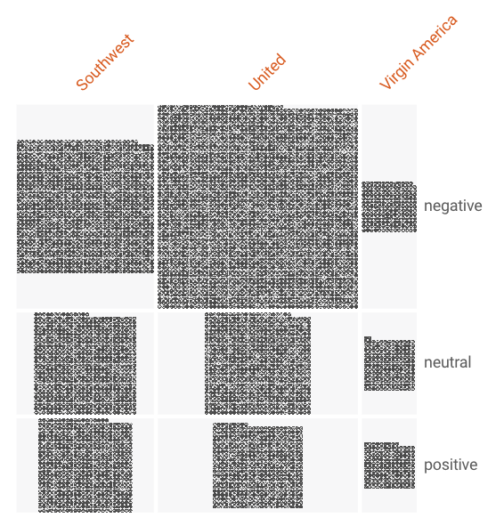
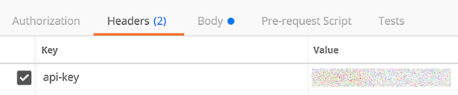
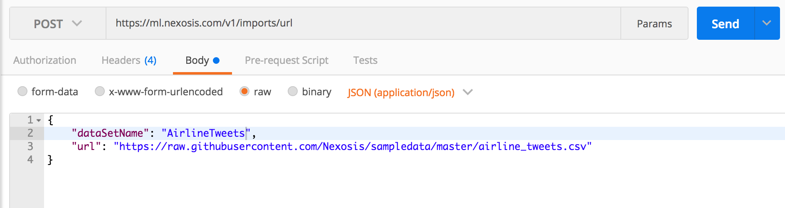
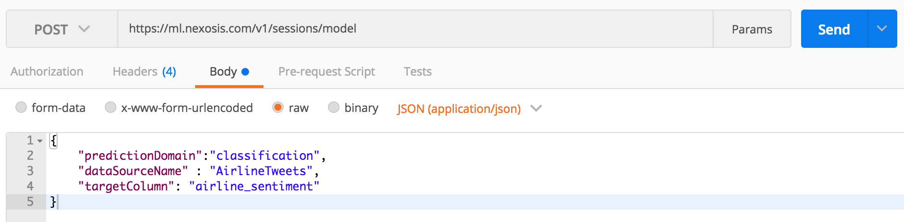
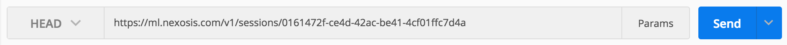
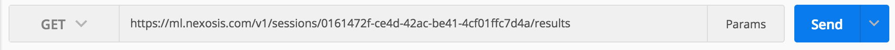
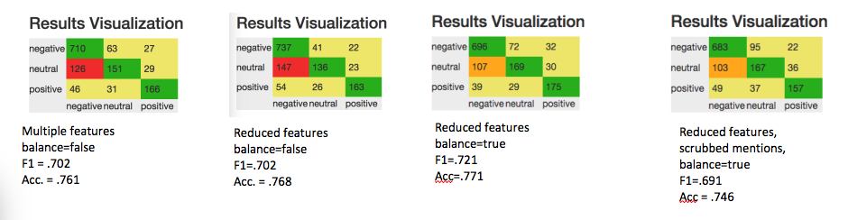
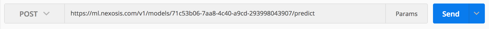

## {{page.title}}

### Getting Started

We're going to look at tweet data related to airlines to demonstrate how to work with *Text* type fields in your data. This dataset was originally provided as part of a [Kaggle competition](https://www.kaggle.com/crowdflower/twitter-airline-sentiment){:target="_blank"}, but I have made a [modified version](https://raw.githubusercontent.com/Nexosis/sampledata/master/airline_tweets.csv){:target="_blank"} available in our samples directory so that you can follow along. 

> Note: you don't need to download the file if you won't be modifying it. We'll talk through how to load it directly into your Nexosis API account.

I'll also be using [Postman](https://www.getpostman.com){:target="_blank"} to interact with the API, so you'll want that to follow along too. I highly suggest using our [Postman templates](https://github.com/Nexosis/nexosis-api-postman){:target="_blank"}. Finally, you'll need your own API Key, which you can find in the [developer portal](https://developers.nexosis.com/developer){:target="_blank"} after you sign up.

### Analyzing the Data
It's important to understand your data before you do any sort of ML. At the very least we want to understand the available columns and their relationship to our target. In this case the data set is a list of tweets sent to various airlines via 'mentions':

* @virginamerica I love the hipster innovation. You are a feel good brand.
* @virginamerica Your chat support is not working on your site

Each of these mentions has been labeled with a sentiment of either *negative*, *positive*, or *neutral*. These labels were added through a crowd-sourcing program and reflect something of an opinion. We won't concern ourselves with further evaluating the sentiment, but will accept the labels as given. The two examples above are labeled **positive** and **negative** respectively.

The original data set as made available on Kaggle included many additional columns which we're not going to use. I've provided some information on my <a href="#exclusions">exclusions below</a>. In our sample dataset we only use the text of the tweet itself and the sentiment label.  

There are just two more data analysis and processing steps to discuss. First, I went ahead and stripped the airline mentions from each tweet. I used a regular expression to remove any initial word in the text field that started with '@'. Having this word in the text lead the model to depend on having airline names in the prediction text. This could be OK in another situation, but here I want the most general model of sentiment I can get - not one focused on an airline. There's also another problem with airline-specific training data.

Have a look at the following value distributions



You can see two things here very clearly: United dominates the dataset, and United's negative tweets dominate the distribution of sentiment labels. 

> The distribution graphic was created by Facets, which you can use online at [https://pair-code.github.io/facets/](https://pair-code.github.io/facets/)

This means that our dataset is *unbalanced*. When building a classification model it can be important to understand the balance of classes in the training data so that you don't build a model that over-emphasizes the dominant class. The Nexosis API assumes unbalanced by default. I'll show some of the experimentation on this setting below, but for now just understand that building a model for a specific airline would likely be a bit different from building the generalized model we're attempting to build here.

Finally, I removed a large number of the observations from the file simply to make it easier to consume for this tutorial. I did however try to maintain the same relative balance of values and achieve a similar accuracy metric with the smaller dataset.

### Upload the Data
Now that we have some understanding of the data itself, let's get it loaded into the Nexosis API. Again, you'll need Postman and an API key to follow along. We're going to make   a POST call to the **imports/url** endpoint with a JSON body defining the URL to import from. Make sure you've entered your API key into the **api-key** header field in Postman before you issue the request.



Within Postman just create a new POST request and input the url below along with the JSON body containing this snippet.

``` json
{
	"dataSetName": "AirlineTweets",
	"url": "https://raw.githubusercontent.com/Nexosis/sampledata/master/airline_tweets.csv"
}
```
It should look like this before you hit 'Send'...

{:style="max-width:840px"}

After the import runs you will have a dataset in your account called *AirlineTweets*. Recall that this dataset has only two columns: **text**, which contains the tweets; and **airline_sentiment** which has the labels. The Nexosis API will automatically determine that the text field is a *Text* data type. However, you can also [set metadata](http://docs.nexosis.com/guides/columnmetadata) if you have a dataset where the Nexosis API inference is incorrect.

### Create A Model
We are going to choose to build a classification model because we have labels which form our 3 target classes: **negative**, **neutral**, and **positive**. The model building process will attempt to determine a mathematical formula from the given text that maps onto the correct labels. From this we will then be able to provide new text and hopefully get an appropriate label of the sentiment. 

Machine learning model building always crunches numbers no matter the original form of the data. In this case we actually have two non-numeric fields, so the features which end up being used will be modified by the Nexosis API to work properly. Part of what makes this possible is that the Nexosis API will turn the *Text* field into a set of numeric features. There's a more complete explanation of the process for feature extraction from *Text* fields in our [document dedicated to that purpose](http://docs.nexosis.com/guides/textfeatures). In short, we create importance scores based off of a formula related to word counts. We don't have to manipulate the class labels because they are the **target** of the formula and not a **feature**. All of that said, <u>you</u> don't have to do anything more than make a request for the model. In this case we're going to make a POST request to the **sessions/model** endpoint. You will need to identify the data source, the type of model to build, and the target (class labels in our case). We're also going to include an extra parameter which tells the machine learning engine to balance the classes when it picks the training data because our data is dominated by the negative class. You can make your session building request with the following JSON body.

``` json
{
	"predictionDomain":"classification",
	"dataSourceName" : "AirlineTweets",
	"targetColumn": "airline_sentiment",
	"extraParameters" : {
		"balance": true
	}
}
```
POST this to https://ml.nexosis.com/v1/sessions/model

{:style="max-width:840px"}

This request starts what we call a *session*. Sessions represent the model building process and can take some time to finish while the machine crunches the numbers. When you sent the request you received a JSON response which contained some infromation about the session which in part included something like this:

``` json
{
   ... some fields removed ...
    "sessionId": "0161472f-ce4d-42ac-be41-4cf01ffc7d4a",
    "type": "model",
    "status": "requested",
    "predictionDomain": "classification",
    ... some fields removed ...
```
Note the *sessionId* field because that's how we're going to check back in on the progress of our model. These are unique ids, so yours will be different. Copy yours and as you follow along use that one where I use mine.

You can get status with a simple HEAD request sent to the **/sessions/:sessionId** endpoint:

{:style="max-width:840px"}

Look in the "Headers" tab of the response in Postman for the header named **Nexosis-Session-Status** which will eventually tell you the session is *completed*.

{:style="max-width:840px"}

Because text fields tend to create thousands of feature columns, sessions with text require a bit of additional crunch time. If you're following along this is a good time to go check on the kids, play a round of Threes - or whatever game you're into, etc. Text-based model builds often take ~30 minutes.

OK, so either you're back or you're skipping ahead and just want to know what happened. Once the session completed I made a GET request to the same endpoint as we checked for status above.

{:style="max-width:840px"}

The important thing in this session response is that it gives us a *modelId* value. The modelId is a unique id that allows us to make calls to our newly created model and get predictions. You'll find it in the JSON response like this:

``` json
	... some fields removed ...
	"sessionId": "0161472f-ce4d-42ac-be41-4cf01ffc7d4a",
    "type": "model",
    "status": "completed",
    "predictionDomain": "classification",
    "availablePredictionIntervals": [],
    "modelId": "71c53b06-7aa8-4c40-a9cd-293998043907",
    ... some fields removed ...
```
Again, just as with sessionId above this is a unique value and if you're following along make sure to get the one from your session GET response. Before we go on to using this model let's get the results so we can evaluate whether or not we like it.

### Model Evaluation
The Nexosis API has actually run several different algorithms to try and find you the best possible model given the dataset provided. The results of the session will provide you the one best algorithm's metrics to help you determine whether it performed well enough to meet your needs. In this case we're trying to judge sentiment of a tweet. A practical application you could imagine would be to automatically test all tweets targeted at your employer's airline and then alert a customer service rep whenever you detect a negative tweet. For this type of use we might have a relatively low bar for accuracy because a human getting involved when the tweet was actually *positive* or *neutral* is low impact. However, if we wanted to retweet automatically every tweet we deemed *positive*, then we might have a higher bar for accuracy. How high? That's up to the individual use case. Let's go ahead and make a GET request to the **/sessions/:sessionId/results** endpoint and see how we did.

{:style="max-width:840px"}

The results response JSON will be somewhat large as we're also going to get back the training data results. For now, let's just look at the *metrics* section at the top of results.

``` json
    "metrics": {
        "macroAverageF1Score": 0.69101809096790012,
        "accuracy": 0.74647887323943662,
        "macroAveragePrecision": 0.69700270281757637,
        "macroAverageRecall": 0.68603354716372145,
        "matthewsCorrelationCoefficient": 0.54417486341193566
    },
```
So what does all this mean? Well, it's going to get geeky here. First off, the *macroAverageF1Score* value is the one we use to pick our winning algorithm. We pick the highest score when comparing models and it usually correlates well with higher *accuracy*. There are [good technical explanations for this metric](http://rushdishams.blogspot.in/2011/08/micro-and-macro-average-of-precision.html) but it basically mixes two other metrics: *precision* and *recall*. These measures come from evaluating the *confusion matrix*, which is ultimately a way to compare *true-positives*, *false-negatives*, and *false-positives*. In short, how often did the model pick the wrong class? The metric for *accuracy* is working from the same base of tests but is little more straightforward calculation of how many total correct (*true-positives* and *true-negatives*) were chosen divided by the count of the whole test set. All of these metrics will tend to increase and decrease together but they are sensitive to different ways of being wrong (false positive or false negative) so they don't strictly have to. The Matthews coefficient incorporates both ways of being wrong and is therefore more challenging to score highly.

The confusion matrix is pretty easy to visualize with our 3 classes, so let's take a look at some of the experimentation I did before arriving on which data to use in this tutorial. 



The confusion matrix is showing each of the classes mapped to one another in a grid where the results of testing are represented as counts of test predictions. The Y-axis is the actual known label with the prediction result label on the X-axis. You can see easily that all of the models struggled to properly categorize neutral tweets. This is probably due to the fact the negative tweets dominate the training data. With each picture you can read the F1 and Accuracy scores associated with the model. From left to right the models were built with 

1. Twitter mention text in-tact, date-time of the tweet, number of re-tweets, API indicator to not balance the training data.
2. Only using the text and the labels, but twitter mentions still in the text and the API indicator to not balance the training data.
3. Same features as #2, but using the API indicator to balance the training set.
4. Removed the mentions and used the API indicator to balance the training set.

Perhaps to some suprise I chose the model on the far right (#4) - which has the worst F1 and Accuracy scores of all the models I built. Why did I do this? In my view it was more important to generalize the model - which meant removing the airline names and/or mentions. I also wanted to reduce the problem of over-predicting on the majority class (negative). These two desires outweighed the apparent improved accuracy for me. But here I must emphasize the value of context for the problem you are trying to solve and the value of experimentation on more and different views of the data.

### Getting Results
So we've built a model and are ready to test it out with some new tweets it has never seen before. Remember that we'll need the *modelId* from our session response. We're going to POST a request to the **/model/:modelId/predict** endpoint with a value in JSON body of the request. I've picked out a random tweet with @united in it from Twitterverse.

``` json
{
	"data":[{
		"text" : ".@united removed woman from flight to see her dying mother: 'nobody flies for free' "
	}],
		"extraParameters" :{
			"includeClassScores" : false
		}
}
```

{:style="max-width:840px"}

After a second or two we get a response with our predicted sentiment class:

``` json
{
    "data": [
        {
            "text": ".@united removed woman from flight to see her dying mother: 'nobody flies for free' ",
            "airline_sentiment": "negative"
        }
    ],
    ... other values removed ...
```

Sure enough, our model found this to be negative and I would agree. Recall that our model was not built with airline names, so leaving the @united text in our sample won't be an important word that biases the results. That is in fact why I removed them. Had we received a negative result from a model that was trained on a lot of negative tweets for @united we wouldn't know if it picked that class just because of the name or because of the text itself. Now, we can be more confident.

Hopefully you've been playing along and have a model of your own. Give the model a try and predict sentiment on some other tweets; have fun with it. You might also try building some other models based on different views of the data. Be sure and tell us how it goes.

***
<a name="exclusions"></a>
### Addendum - Excluded Columns

* *tweet_id* - The unique id of a tweet is not going to carry any predictive power as it is just a random number
* *airline_sentiment_confidence* - this is the crowd-sourcing metric for the given sentiment. One could potentially use this to remove observations lower than some threshold, but we're just going to ignore it.
* *negativereason* - This field is sparsely populated and when provided (other than "can't tell") is only available for negative tweets. This means that any value would be highly correlated with a 'negative' sentiment and our model wouldn't be be guessing at all. We could use this field as a different target in a different model.
* *negativereason_confidence* - not useful at all since we're not using negativereason
* *airline* - while possibly an interesting indicator for one airline, we want a generalized model that can determine tweet sentiment no matter which airline. The airline also happens to be captured in every tweet's text value.
* *airline_sentiment_gold* - almost no values here  
* *name* - personal name of the tweet owner and does not carry predictive power in a general model.
* *negativereason_gold* - again, no relationship to the model
* *retweet_count* - This could be interesting and worthy of investigation, but is nearly always 0 and in a few test runs I found it hurt the model's accuracy.
* *tweet_coord* - specific location which would not likely help with predictions even if correlated with other location data and also hard to come up with at prediction time.  
* *tweet_created* - A possible feature worth investigating but again it seemed to hurt model accuracy. 
* *tweet_location* - similar to tweet_coord, but worse. This is a free-form field that is not likely to have overlapping values that correlate.
* *user_timezone* - basic intuition that this doesn't have any corrlation. I could envision mixing this with tweet time to engineer a feature around relative 'late' or 'early' indicators. However, the field is a bit sparse and I didn't think it would enhance this tutorial.