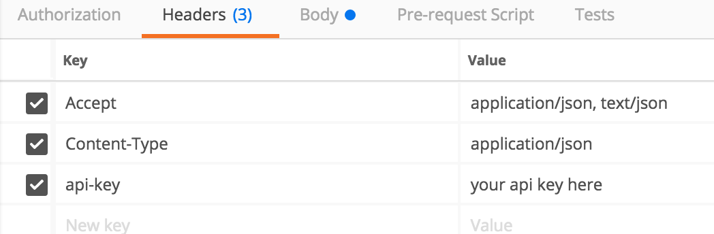

## Classification with Scores
In this tutorial we'll cover creating a classification model and using it to classify R, G, and B values into named colors. We'll then use the model to also get scores from the model for each of the candidate classes. We'll do this in 3 steps:

- <a href="#upload">Upload Data</a>
- <a href="#model">Build A Model</a>
- <a href="#predict">Predict Colors</a>


### Classication of Color with RGB
When executing a classification model we want the algorithm to identify a class (group, bucket, name, etc) based on new observations so the machine can tell us what something is. In our example here we want to hand in values of the 3 constituents of a Red, Green, and Blue based color and get a name for the color mapped to these values; for example if we have R: 255, G: 0, B: 0 as our observations, we should find this will be labeled *Red*. A trivial end goal perhaps, but all of the concepts are the same as classifying something as important as 'cancer'/'not cancer'.

> You can see one of many online color maps at [RapidTables](https://www.rapidtables.com/web/color/RGB_Color.html){:target="_blank"}.

In order for the machine to learn the relationship between these 3 variables we feed it a training set that has many different combinations of R, G, and B and an existing label:

<table>
	<tr>
		<th>R</th>
		<th>G</th>
		<th>B</th>
		<th>Color</th>
	</tr>
	<tr>
		<td>255</td>
		<td>0</td>
		<td>0</td>
		<td><div style="background-color:Red;text-align:center;margin:-13px;padding:7px;">Red</div></td>
	<tr>
		<td>255</td>
		<td>255</td>
		<td>0</td>
		<td><div style="background-color:Yellow;text-align:center;margin:-13px;padding:7px;">Yellow</div></td>
	</tr>
	<tr>
		<td>233</td>
		<td>150</td>
		<td>122</td>
		<td><div style="background-color:Salmon;text-align:center;margin:-13px;padding:7px;">Salmon</div></td>
	</tr>
</table>

You get the idea. Generally speaking we don't want an overload of classes so in reality we're going to use only some major colors and categorize things like *Salmon* as *Red* instead. You can take a look at the full dataset in our [sample data repository on GitHub](https://raw.githubusercontent.com/Nexosis/sampledata/master/rgb.csv){:target="_blank"}. To get things started let's go ahead and load this dataset into our Nexosis API. 

> If you haven't signed up and want to follow along - get started with your free API key by registering here: [https://account.nexosis.com/account/register](https://account.nexosis.com/account/register){:target="_blank"}

I am going to use [Postman](https://www.getpostman.com/postman){:target="_blank"} for these examples - feel free to use whatever you're comfortable with. You can load the Nexosis Postman collection from our [GitHub repo](https://github.com/Nexosis/sample-postman){:target="_blank"}. I will assume that you have set a header in postman for the api-key value and won't mention that again throughout this post.



### Load the RGB.csv Dataset
<a name="upload"/>
In this case I am going to load the file via the [imports/url](https://developers.nexosis.com/docs/services/98847a3fbbe64f73aa959d3cededb3af/operations/5a2af0a8adf47c0d20245a67){:target="_blank"} endpoint:

```
POST https://ml.nexosis.com/v1/imports/url
```
We need a couple of variables in the JSON payload; one to name this dataset, and another to identify the link from which the content should be imported.

``` json
{
  "dataSetName": "RGB",
  "url": "https://raw.githubusercontent.com/Nexosis/sampledata/master/rgb.csv"
}
```
Once you've executed this POST the Nexosis API will grab the content from the url and add a DataSet named *RGB*. When requesting a model session the DataSet name will be used as the data source from which the model is built.

### Build the Model
<a name="model"/>

We'll now submit a model build session request to the Nexosis API. Building a model means allowing an algorithm to run over the dataset to figure out the relationship between variables. This *learning* process is of course the whole point of ML. The resulting model is just a persistent calculation we can use on subsequent rows of data where we may not know the label or class. For example when we submit <span style="background-color:#F08080;margin:2px"> R: 240; G: 128; B: 128 </span> we expect the model to return the class prediction *Red*.  With the Nexosis API we build a model by making a call to the [sessions/model](https://developers.nexosis.com/docs/services/98847a3fbbe64f73aa959d3cededb3af/operations/59d79fa1adf47c0d60484fe9){:target="_blank"} endpoint:

```
POST https://ml.nexosis.com/v1/sessions/model
```

The JSON body of the request will contain a few bits of information about exactly what kind of model we want to build, and which data source should be used to train it.

``` json
{
  "dataSourceName": "RGB",
  "targetColumn": "Color",
  "predictionDomain": "Classification"
}
```
The *targetColumn* is the name of the column which contains the labels in our data source; in this case *Color*. Sessions take a little bit of time to run as the model building process is basically a whole lot of number crunching. The response to the session POST will contain a *sessionId* property. Take note of this value so we can check the status of the session.

``` json
{
    "columns": {
        "B": {
            "dataType": "numeric",
            "role": "feature",
            "imputation": "zeroes",
            "aggregation": "sum"
        },
        "G": {
            "dataType": "numeric",
            "role": "feature",
            "imputation": "zeroes",
            "aggregation": "sum"
        },
        "R": {
            "dataType": "numeric",
            "role": "feature",
            "imputation": "zeroes",
            "aggregation": "sum"
        },
        "Color": {
            "dataType": "string",
            "role": "target",
            "imputation": "mode",
            "aggregation": "mode"
        }
    },
    "sessionId": "0160bdf7-cd8f-458f-9b46-6413ff6973bc",
    "type": "model",
    "status": "completed",
    "predictionDomain": "classification",
    ...additional properties removed...
}
```

Give this one a minute or two; sessions with larger datasets tend to take a while longer. You can get the session details from the /sessions/:sessionid: endpoint

```
GET https://ml.nexosis.com/v1/sessions/0160bdf7-cd8f-458f-9b46-6413ff6973bc
```

 The response JSON will include a property *modelId* once the session has completed. This is the value we'll need to finally get some predictions from the hosted model.

``` json
{
    ...
    "modelId": "82291eff-80c5-4c58-bf46-961266d00115",
    ...
}
```
### Color Predictions
<a name="predict"/>
Now that we have a model we can ask for the name of a color based on values for R,G, and B. Let's use the coral color from above as it is in the training set. We request predictions from the [model/:modelid:/predict](https://developers.nexosis.com/docs/services/98847a3fbbe64f73aa959d3cededb3af/operations/59d79fa1adf47c0d60484fe8){:target="_blank"} endpoint:

```
POST https://ml.nexosis.com/v1/model//predict
```
The JSON request body will include the values for R,G,B for which we want to predict a color. The request takes an array in the *data* property because we could submit multiple predictions in the same request.

``` json
{
	"data" :[
		{
			"R" : 240,
			"G": 128,
			"B": 128
		}
	]
}
```

The response echoes back the same data along with the target column value filled in, which is the prediction made by the model.

``` json 
{
    "data": [
        {
            "R": "240",
            "G": "128",
            "B": "128",
            "Color": "orange"
        }
    ],
    ...additional properties removed...
}
```
OK, in this case the model returns 'orange' instead of the expected value of 'red'. This is certainly interesting since the values were in the training data. It's possible they were not used to train the model because the Nexosis API holds some data back for model validation (a test set). However, it's also true that you don't want a model which perfectly fits the test set. Models which fit the training data 'too well' don't generalize properly to data they have not encountered. In order to get more information about what happened we can actually request the prediction along with *scores* for each candidate class. While you might not want to request class scores in a production model, it can be very helpful when trying to understand the model the Nexosis API built for you.  Let's make our prediction request again, but this time we'll include an extra pramameter asking for scores.

``` json
{
	"data" :[
		{
			"R" : 240,
			"G": 128,
			"B": 128
		}
	]
	,
	"extraParameters":{
		"includeClassScores": true
	}
}
```
Now our data array contains a value for every candidate class from the training set.

``` json
{
    "data": [
        {
            "R": "240",
            "G": "128",
            "B": "128",
            "Color": "orange",
            "Color:black": "7.29418838303361",
            "Color:blue": "-0.5",
            "Color:gray": "4.0174857856359",
            "Color:green": "0.756504457848939",
            "Color:indigo": "2.85456999991865",
            "Color:orange": "10.2665103262507",
            "Color:purple": "8.26093589010436",
            "Color:red": "9.17253308066117",
            "Color:violet": "6.1500767145064",
            "Color:white": "2.8817379916523",
            "Color:yellow": "3.84545737038799"
        }
    ]
}
```
Here we see some information about the model's decision making. Red was a close second, but the label orange was a better choice.

> Scores are values which quantify the certainty that the model associates a given observation with each class. A higher score is more certain. These are not percentages, or even something to compare between models; but within a given model give an indication of the strength of relationship to the submitted observations. 

We can also see that this color has absolutely nothing to do with blue, but could marginally be related to violet.  Again, with colors this information is intutitive and perhaps not telling you something you couldn't easily perceive. Yet, the power of the machine to pick up on this information and to provide relative values of association between classes has interesting implications for other ways to use classification algorithms in the Nexosis API. 

What could you find out with a classification model built by the Nexosis API?